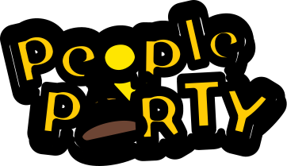

People Party is a fun party game to play with your friends on a big screen. Currently available on peopleparty.nl!

## Cause
People Party was conceived during the Games Programming semester at [Windesheim](windesheim.nl).
It's created by a group of four students during 8 weeks.

## Contributer
Do you want to help us out and add your own minigame?
Read [How to add a game](https://github.com/Kraanter/PeopleParty/wiki/How-to-add-a-game) in our Wiki.

## Build
Build flatbuffers: `npm i && npm run build`.
Follow the guides in the `frontend` and `backend` folder.